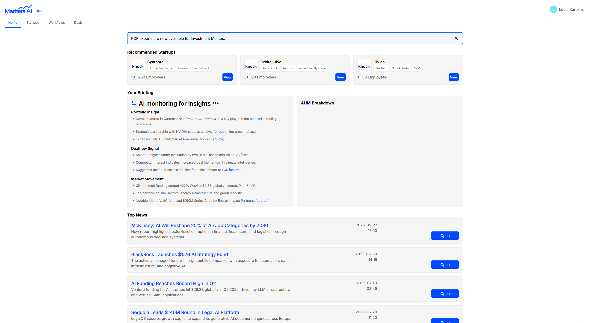
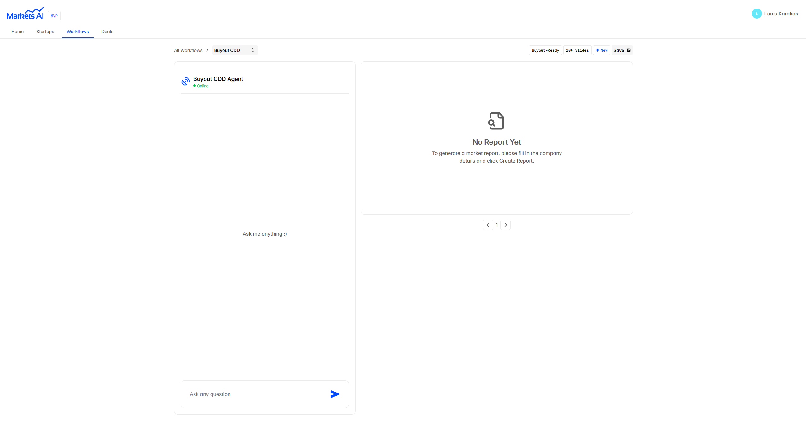
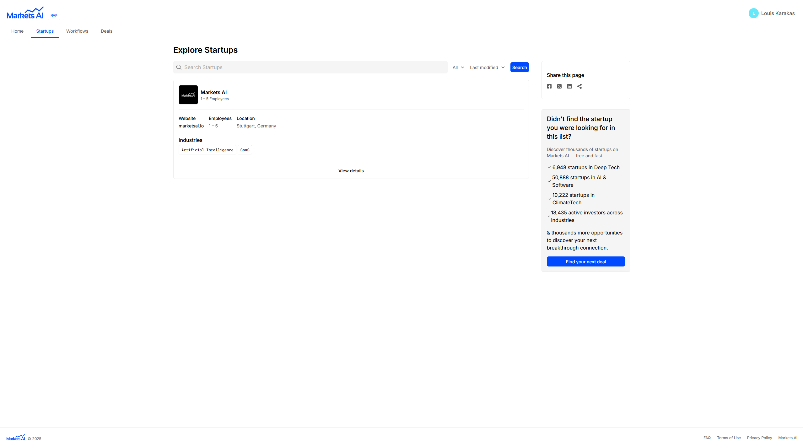
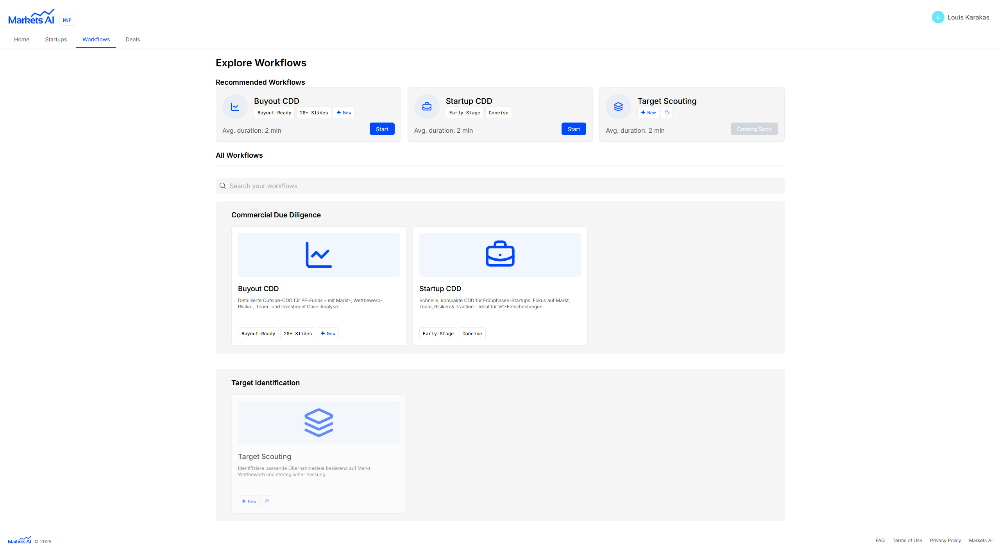

# Markets AI – Commercial Due Diligence Intelligence

Markets AI is an AI-native deal qualification & research engine for Angel Investors, Family Offices & Private Equity.

It extracts signal from decks, documents, market reports and generates first-pass commercial assessments — in minutes, not days.

Built solo, full end-to-end — including domain modelling, prompt-ops, product flows & agent orchestration.

---

## Screens

### Briefing

### Commercial Due Diligence

### Startup Exploration

### Workflows

---

## Why this exists
Investors lose enormous time on pre-DD “screening work”.  
The bottleneck isn’t capital — it’s analyst hours.

Markets AI compresses the first 20–40h of analyst labour into ~60 seconds.

---

## What Markets AI does
- generate investment memos (1–2 page)
- extract commercial logic from pitch decks & URLs
- analyze competitive positioning
- rank attractiveness of deal vs. market reference class
- roadmap: founder-side accounts → 2-sided marketplace

This is an actual commercial due diligence engine — not a UI wrapper around GPT.

---

## Tech Stack
| Layer | Tools |
|---|---|
| Frontend | Next.js |
| AI / Agent Runtime | OpenAI Agents SDK, CrewAI |
| Data | MongoDB |

---

## Architecture — high level
Next.js UI → agent orchestration layer → multiple LLM tools (specialised subagents)  
Memo writing = synthetic consensus across multiple agent outputs.

---

## Role
Solo built: research → modelling → product → infra.

Year built: 2025

---

## What was interesting here
- agent orchestration (CrewAI) for composite reasoning
- architecture for model-consistent memo outputs
- implicit grounding baseline vs. real market comparables

---

## Status
Active internal product
